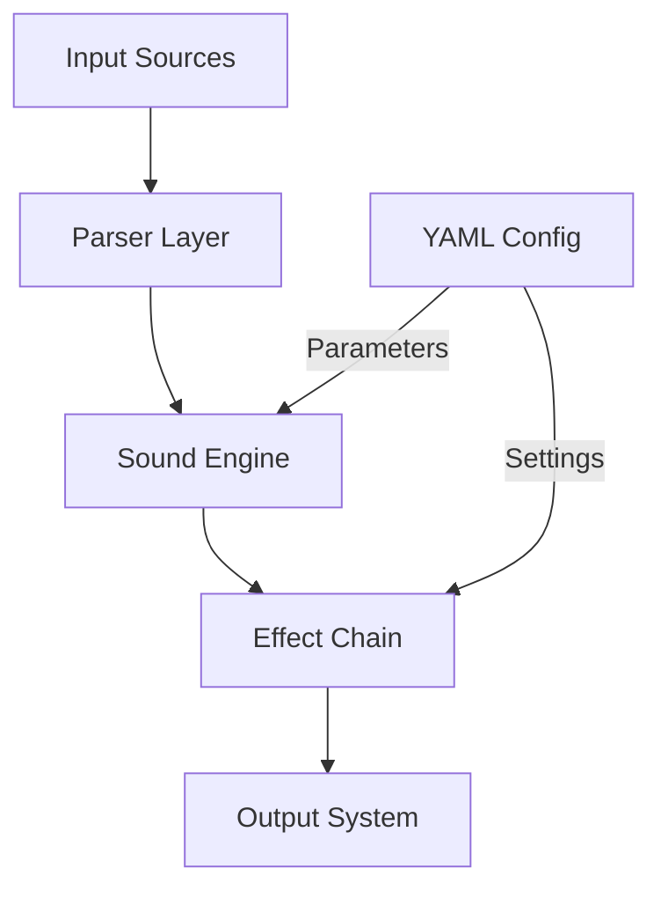

# Robotic Psalms - Sacred Machinery Architecture

## System Overview
This system generates ethereal computerized vocal arrangements of Latin psalms in the style of Jóhann Jóhannsson's "Odi et Amo".

## Core Components

### 1. Input Processing Layer
- Psalm Text Processor (Latin parsing, verse markers)
- MIDI Input Handler (melodic structure import)
- Configuration Manager (YAML-based parameter control)

### 2. Sound Generation Core
- Sacred Machinery Synthesizer
  * Layered Glacial Pads
  * Vocal Synthesis Engine
  * Stochastic Percussion
  * Drone Modulation System

### 3. Effect Processing Chain
- `apply_robust_formant_shift` (Vocal)
- `apply_high_quality_reverb`
- `apply_complex_delay`
- `apply_refined_glitch`
- `apply_saturation`
- `apply_chorus`
- `apply_smooth_spectral_freeze` (within Haunting)
- `apply_master_dynamics` (Final Output)

### 4. Output Management
- WAV Audio Renderer (Master and Stems)

## Data Flow Architecture

## Key Interfaces

### 1. Configuration Schema
*(Note: The detailed configuration schema is defined using Pydantic models within `src/robotic_psalms/config.py`. This includes nested structures for various effects like `GlitchParameters`, `ReverbConfig`, `DelayConfig`, `ChorusParameters`, `SaturationParameters`, `MasterDynamicsParameters`, `SpectralFreezeParameters`, etc. Please refer to `config.py` for the definitive source of truth.)*

### 2. Error Handling
- VoxDeiSynthesisError: TTS engine failures
- LiturgicalValidationError: Latin text validation
- AudioProcessingError: Sound generation issues

## Performance Requirements
- Real-time parameter modulation
- 24-bit/48kHz audio processing
- < 10ms latency for live control
- Multi-threaded synthesis pipeline

## Technical Dependencies
- Audio: numpy, scipy, librosa
- MIDI: mido, python-rtmidi
- Synthesis: sounddevice
- Text: espeak-ng (System command-line tool)
- Config: pyyaml, pydantic

## Implementation Notes
1. Use async processing for real-time parameter updates
2. Implement thread-safe parameter controls
3. Cache frequently used audio samples
4. Monitor CPU/memory usage for stability
5. **Refactoring Note (April 2025):** The TTS engine was refactored to directly call the system's `espeak-ng` command-line tool using `subprocess.run`, bypassing Python wrappers and resolving previous stability issues. Festival is no longer used.
6. **Future Direction:** Subsequent development aims to enhance artistic expression through improved effects, complex ambient layers, and melodic control, as detailed in `project_specification_v3.md`.