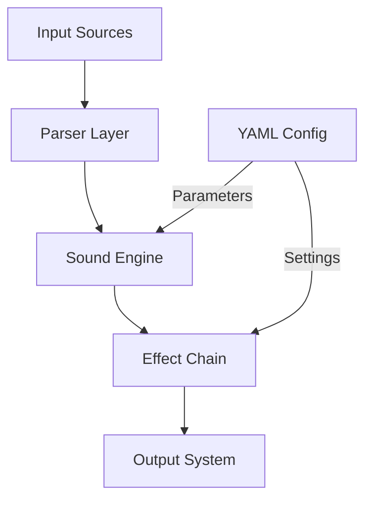

# Robotic Psalms - Sacred Machinery Architecture

## System Overview
This system generates ethereal computerized vocal arrangements of Latin psalms in the style of Jóhann Jóhannsson's "Odi et Amo".

## Core Components

### 1. Input Processing Layer
- Psalm Text Processor (Latin parsing, verse markers)
- MIDI Input Handler (melodic structure import)
- Configuration Manager (YAML-based parameter control)

### 2. Sound Generation Core
- Sacred Machinery Synthesizer
  * Layered Glacial Pads
  * Vocal Synthesis Engine
  * Stochastic Percussion
  * Drone Modulation System

### 3. Effect Processing Chain
- Reverb/Freeze Processor
- Glitch Generator
- Spectral Manipulator
- Formant Shifter

### 4. Output Management
- Multi-track Renderer
- MIDI Export System
- Visual Generator
- Documentation Engine

## Data Flow Architecture


## Key Interfaces

### 1. Configuration Schema
```yaml
synthesis:
  mode: enum[dorian, phrygian, lydian, mixolydian, aeolian]
  tempo_scale: float
  
effects:
  glitch_density: float[0-1]
  celestial_harmonicity: float[0-1]
  robotic_articulation:
    phoneme_spacing: float
    consonant_harshness: float
  haunting_intensity:
    reverb_decay: float
    spectral_freeze: float

voice:
  timbre_blend:
    choirboy: float[0-1]
    android: float[0-1]
    machinery: float[0-1]
```

### 2. Error Handling
- VoxDeiSynthesisError: TTS engine failures
- LiturgicalValidationError: Latin text validation
- AudioProcessingError: Sound generation issues

## Performance Requirements
- Real-time parameter modulation
- 24-bit/48kHz audio processing
- < 10ms latency for live control
- Multi-threaded synthesis pipeline

## Technical Dependencies
- Audio: numpy, scipy, librosa
- MIDI: mido, python-rtmidi
- Synthesis: sounddevice
- Text: espeakng (Python wrapper for system `espeak-ng`)
- Config: pyyaml, pydantic

## Implementation Notes
1. Use async processing for real-time parameter updates
2. Implement thread-safe parameter controls
3. Cache frequently used audio samples
4. Monitor CPU/memory usage for stability
5. **Refactoring Note (April 2025):** The TTS engine was refactored to use the `espeakng` Python wrapper interacting with the system's `espeak-ng` command-line tool, resolving previous stability issues. Festival is no longer used.
6. **Future Direction:** Subsequent development aims to enhance artistic expression through improved effects (reverb, formant shifting), complex ambient layers, and melodic control, as detailed in `artistic_specification.md`.